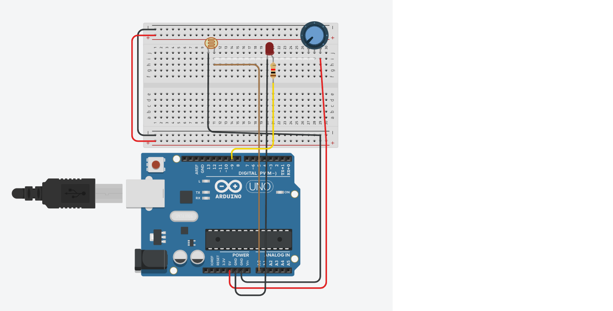

# LDR-Based-PWM-Ambient-Light-Controller
This project demonstrates a fundamental embedded system design. It uses a photoresistor (LDR) and a potentiometer within a voltage divider network to sample ambient light levels. The analog readings are dynamically processed and mapped to an 8-bit Pulse Width Modulation (PWM) signal. This provides a smooth, soft-start dimming control over an LED, replacing traditional on/off switching with a system that continuously adapts to its physical environment.

